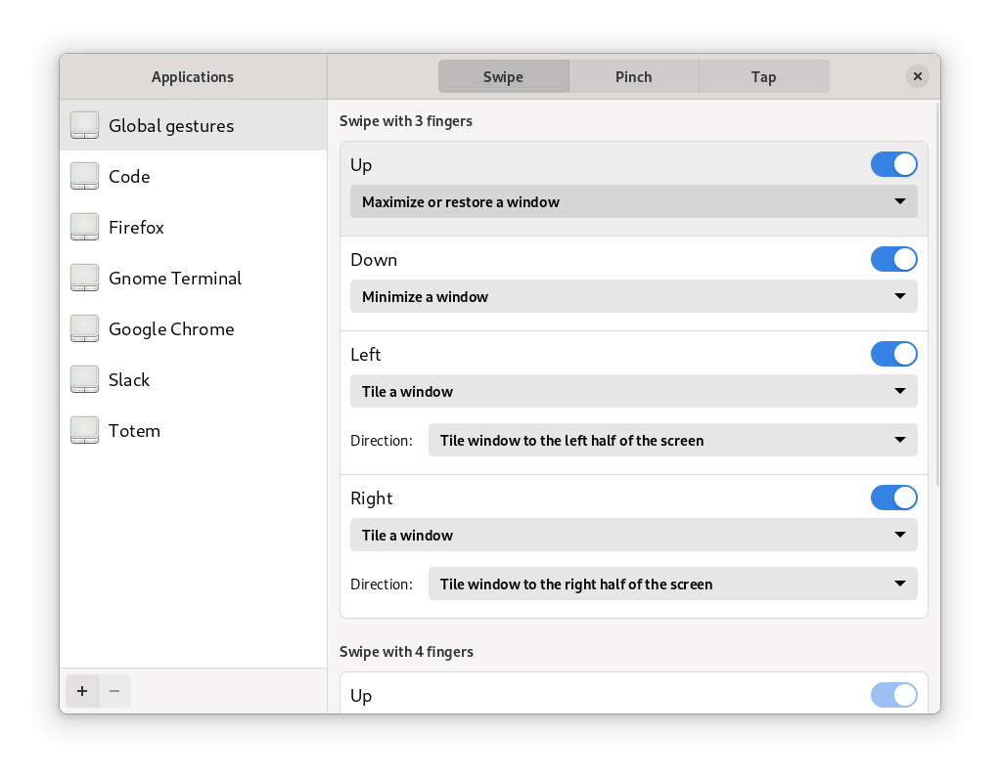
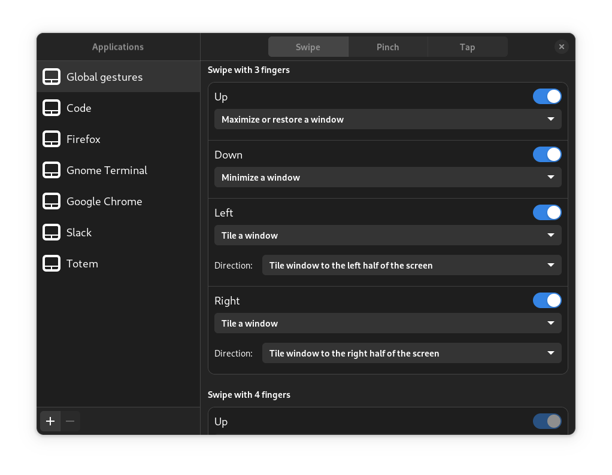

**Follow Touché on...**  

 

# Touché
The desktop application to configure [Touchégg](https://github.com/JoseExposito/touchegg)

 

## About

Easily configure your touchpad and touchscreen multi-touch gestures using
[Touchégg](https://github.com/JoseExposito/touchegg) with this GTK graphical user interface.

  

  
More screenshots

  

 

  

  Or download a package for [Arch Linux](https://aur.archlinux.org/packages/touche)

### Using GNOME?

Don't forget to also the [X11 Gestures](https://github.com/JoseExposito/gnome-shell-extension-x11gestures)
GNOME Shell extension.
